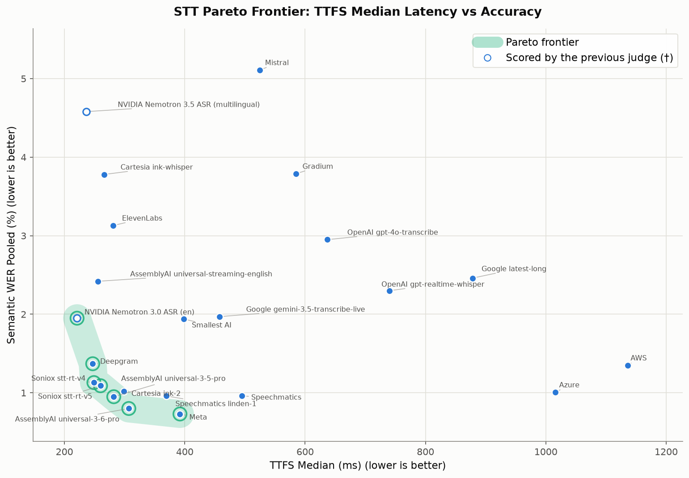
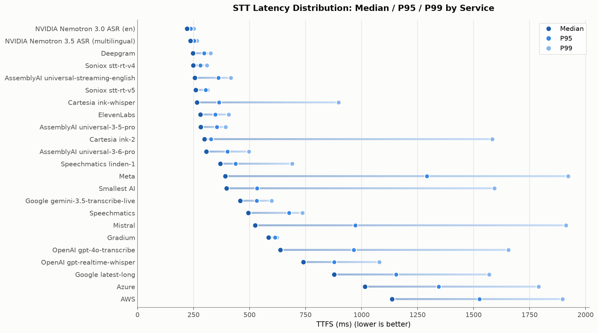

# STT Benchmark

A framework for benchmarking Speech-to-Text services with TTFS (Time To Final Segment) latency and Semantic WER (Word Error Rate) accuracy measurement.

## Results Summary

Benchmark results on 1000 samples from the `pipecat-ai/smart-turn-data-v3.1-train` dataset.

<!-- RESULTS_TABLE:START -->
| Vendor | Model | Transcripts | Perfect | WER Mean | Pooled WER | TTFS Median | TTFS P95 | TTFS P99 |
|--------|-------|-------------|---------|----------|------------|-------------|----------|----------|
| AssemblyAI | universal-3-6-pro | 99.9% | 88.7% | 0.89% | 0.80% | 307ms | 401ms | 498ms |
| AssemblyAI | universal-3-5-pro | 99.9% | 86.0% | 1.12% | 0.95% | 282ms | 354ms | 393ms |
| AssemblyAI | universal-streaming-english | 99.8% | 66.8% | 2.81% | 2.42% | 256ms | 362ms | 417ms |
| AWS | N/A | 100.0% | 79.1% | 1.26% | 1.35% | 1136ms | 1527ms | 1897ms |
| Azure | N/A | 100.0% | 83.5% | 0.98% | 1.01% | 1016ms | 1345ms | 1791ms |
| Cartesia | ink-2 | 100.0% | 83.6% | 1.14% | 1.02% | 299ms | 328ms | 1584ms |
| Cartesia | ink-whisper | 99.9% | 61.4% | 3.32% | 3.78% | 266ms | 364ms | 898ms |
| Deepgram | nova-3-general | 99.8% | 77.7% | 1.32% | 1.37% | 247ms | 298ms | 326ms |
| ElevenLabs | scribe_v2_realtime | 99.7% | 80.3% | 3.05% | 3.13% | 281ms | 348ms | 407ms |
| Google | gemini-3.5-transcribe-live | 99.9% | 78.3% | 1.93% | 1.97% | 458ms | 532ms | 599ms |
| Google | latest-long | 100.0% | 69.7% | 2.46% | 2.46% | 878ms | 1155ms | 1570ms |
| Gradium | default | 99.3% | 65.6% | 3.81% | 3.79% | 585ms | 614ms | 623ms |
| Meta | muse-voice-transcribe-1.0 | 99.9% | 89.5% | 0.80% | 0.73% | 392ms | 1292ms | 1922ms |
| Mistral | voxtral-mini-transcribe-realtime-2602 | 99.3% | 67.7% | 4.49% | 5.11% | 525ms | 973ms | 1913ms |
| NVIDIA | Nemotron 3.0 ASR (en) | 100.0% | 76.1% | 1.90%† | 1.95%† | 221ms | 238ms | 252ms |
| NVIDIA | Nemotron 3.5 ASR (multilingual) | 99.6% | 62.0% | 4.54%† | 4.58%† | 236ms | 253ms | 266ms |
| OpenAI | gpt-4o-transcribe | 99.3% | 75.7% | 3.10% | 2.95% | 637ms | 965ms | 1655ms |
| OpenAI | gpt-realtime-whisper | 100.0% | 73.3% | 2.41% | 2.30% | 740ms | 878ms | 1080ms |
| Smallest AI | pulse | 100.0% | 74.0% | 1.85% | 1.94% | 398ms | 533ms | 1593ms |
| Soniox | stt-rt-v5 | 99.8% | 83.6% | 1.11% | 1.09% | 260ms | 305ms | 313ms |
| Soniox | stt-rt-v4 | 99.8% | 83.2% | 1.04% | 1.13% | 249ms | 281ms | 310ms |
| Speechmatics | linden-1 | 99.5% | 83.9% | 1.11% | 0.96% | 369ms | 438ms | 690ms |
| Speechmatics | N/A | 99.7% | 83.1% | 1.17% | 0.96% | 495ms | 676ms | 736ms |
<!-- RESULTS_TABLE:END -->

Small WER differences aren't meaningful on this data. Among the most accurate services, differences of less than about 0.25 percentage points are within the 95% confidence interval from bootstrap resampling of the benchmark samples, so those services can't be reliably ranked against each other; the margin is wider for less accurate services.

† Scored by the previous judge (Claude Sonnet 4.5), which reports WER about 15% higher on average than the current judge. These rows will be re-scored.

> **Scoring update (September 2026):** Semantic WER is now judged by Claude Sonnet 5.5, replacing Claude Sonnet 4.5. Repeated words, stutters, and restarts in a transcription no longer count as errors, and a word split in two or merged with its neighbour counts as one error. WER fell for almost every service, by about 13% on average, mostly from fewer counted insertions; the Pareto frontier is unchanged. Earlier results are in the git history. See [Semantic WER](#semantic-wer) for how scoring works.

### Latency vs Accuracy Trade-off

**Typical Latency (Median)**



The Pareto frontier shows services that offer the best trade-off between latency and accuracy—no other service is better on both metrics. Services on the frontier represent efficient choices depending on your priorities.

Each point is a service's pooled WER. Points close together on the WER axis may not differ meaningfully; see the note under the [results table](#results-summary).

### Latency Consistency

**Median / P95 / P99 by Service**



For production voice agents, **tail latency matters more than median**. Even occasional high latency (5% of interactions) can break the conversational flow. A service with a great median but a long tail indicates inconsistent performance—the length of each row above is the size of that service's latency tail.

### Metrics Glossary

| Metric | Description |
|--------|-------------|
| **Transcripts** | Percentage of samples where STT successfully returned a transcription. Samples without one are left out of the WER and Perfect columns |
| **Perfect** | Transcriptions with 0% semantic WER, out of the samples with a transcription |
| **WER Mean** | Average semantic word error rate across samples |
| **Pooled WER** | Weighted WER (total errors / total reference words) |
| **TTFS Median** | Median time from user stops speaking to final transcription segment |
| **TTFS P95** | 95th percentile TTFS - worst 5% of samples have latency above this |
| **TTFS P99** | 99th percentile TTFS - worst 1% of samples have latency above this |

> **Semantic WER** measures only transcription errors that would impact an LLM agent's understanding. Punctuation, contractions, filler words, and equivalent phrasings are ignored.

> **TTFS (Time To Final Segment)** is measured from when the user stops speaking to when the final transcription segment is received. For streaming voice agents, lower TTFS means faster response times.

## Contributing a Result

The Results Summary table above is the **single source of truth** for the
published numbers and the Pareto charts. Multiple people contribute, so results
are added one row at a time rather than by rebuilding the whole table. To add
your model's result:

1. Benchmark and score it locally:
   ```bash
   uv run stt-benchmark run --services <key>
   uv run stt-benchmark wer --services <key>
   ```
2. Upsert just your row into the table — this reads only your service's metrics
   from your local database and leaves every other vendor's row untouched:
   ```bash
   uv run stt-benchmark update-readme --services <key>
   ```
3. Regenerate the charts from the table (read-only with respect to the README),
   then commit `README.md` and `assets/*.png`:
   ```bash
   uv run python scripts/pareto-frontier-plot.py
   ```

A brand-new vendor or model also needs a registry entry first — see
**[Adding Models](docs/adding-models.md)** for the full checklist.

## Measure TTFS for Your Service

If you're using Pipecat and want TTFS latency numbers for your STT service and configuration, see **[Measuring TTFS](docs/measuring-ttfs.md)** for a quick start guide. The P95/P99 values from this tool can be used directly in Pipecat's `ttfs_p99_latency` service configuration (Pipecat 0.0.102+).

## Quick Start

```bash
# Install dependencies
uv sync

# Download audio samples
uv run stt-benchmark download --num-samples 100

# Run benchmarks
uv run stt-benchmark run --services deepgram,openai

# Generate ground truth (Gemini)
uv run stt-benchmark ground-truth

# Calculate semantic WER (Claude)
uv run stt-benchmark wer

# View results
uv run stt-benchmark report
```

## Installation

Requires Python 3.11+ and [uv](https://docs.astral.sh/uv/).

```bash
git clone <repo-url>
cd stt-benchmark
uv sync
```

## Environment Variables

Copy `env.example` to `.env` and set your API keys:

```bash
cp env.example .env
```

## How It Works

### TTFS Measurement

**TTFS for STT is different from typical request/response latency.** Since STT services receive continuous audio input, there's no discrete request to measure from. Instead, we measure from when the user **stops speaking** to when the **final transcription** arrives.

```
┌─────────────────────────────────────────────────────────────────────────────┐
│ VADUserStartedSpeaking              Actual speech    VADUserStopped         │
│        t=0                            ends           SpeakingFrame          │
│         │                              │                  │                 │
│         ▼                              ▼                  ▼                 │
│  ═══════╪══════════════════════════════╪══════════════════╪════             │
│         │      Audio streaming to STT  │   VAD stop_secs  │                 │
│         │                              │◄────────────────►│                 │
│         │                              │                  │                 │
│         │                              └──── TTFS ────────┼────────►        │
│         │                           speech_end_time       │     T3          │
│         │                                                 │  (final         │
│         │     T1              T2                          │ transcript)     │
│         │      │               │                          │                 │
│         │      ▼               ▼                          │                 │
│         │  transcript      transcript                     │                 │
└─────────────────────────────────────────────────────────────────────────────┘
```

**Key points:**
- `speech_end_time` = `VADUserStoppedSpeakingFrame` timestamp − VAD `stop_secs`
- TTFS = final `TranscriptionFrame` receipt time − `speech_end_time`
- Streaming services emit multiple partial transcripts; we use the **final** one

**Why the final transcript?** For LLM/TTS, there's a discrete input→output making latency measurement simple. For streaming STT, audio flows continuously and generates multiple `TranscriptionFrame`s. We can't know when the STT service finalized audio for intermediate transcripts, so we measure from the final one and use the VAD signal to determine when the user actually stopped speaking.

### Semantic WER

Traditional WER penalizes every word difference equally. "gonna" vs "going to" counts as 2 errors.

**Semantic WER** uses Claude to evaluate whether differences actually matter:

| Ignored (not errors) | Counted (errors) |
|---------------------|------------------|
| Punctuation, capitalization | Word substitutions that change meaning |
| Contractions ("don't" → "do not") | Nonsense/hallucinated words |
| Singular/plural ("license" → "licenses") | Missing words that change intent |
| Filler words ("um", "uh") | Wrong names, numbers, negations |
| Number formats ("3" → "three") | Factual errors |
| Repeated words, stutters, and restarts ("I, I guess") | A word split or merged ("backyard" → "back card"), as one error |

This gives accuracy metrics that reflect real-world impact on downstream LLM applications.

The judge lists the errors it finds; the WER is computed from that list, divided by a word count calculated once for each reference, so every service is scored against the same count for the same sentence.

The judge is Claude Sonnet 5.5 with adaptive thinking at `medium` effort, configured in [`semantic_wer.py`](src/stt_benchmark/evaluation/semantic_wer.py). Each result records the judge that produced it, and `stt-benchmark wer` won't add results to a service that another judge scored, since the two sets of scores aren't comparable. After changing the judge, re-score with `--force-recalculate`. To measure a judge before re-scoring with it, use the [judge experiment scripts](scripts/README.md#judge-experiments).

## Supported Services

Each service key is one (vendor, model) pair — a vendor with multiple models has multiple keys (e.g. `cartesia` / `cartesia_ink2`, `assemblyai` / `assemblyai_universal_3_6_pro`). The full list is defined in [`src/stt_benchmark/services.py`](src/stt_benchmark/services.py) (`STT_SERVICES`). To add a model, see [docs/adding-models.md](docs/adding-models.md). See `env.example` for required API keys.

## CLI Commands

### Running Benchmarks

```bash
# Benchmark specific services
uv run stt-benchmark run --services deepgram,openai

# Benchmark all configured services
uv run stt-benchmark run --services all

# Limit samples and adjust VAD
uv run stt-benchmark run --services deepgram --limit 50 --vad-stop-secs 0.3
```

### Generating Ground Truth

```bash
# Generate ground truth for all samples
uv run stt-benchmark ground-truth

# Interactive review with audio playback
uv run stt-benchmark ground-truth review <run_id>
```

### Calculating Semantic WER

```bash
# Calculate for all services
uv run stt-benchmark wer

# Force recalculate
uv run stt-benchmark wer --services deepgram --force-recalculate
```

### Viewing Reports

```bash
# Compare all services
uv run stt-benchmark report

# Detailed report for one service
uv run stt-benchmark report --service deepgram

# Show worst samples
uv run stt-benchmark report --service deepgram --errors 10
```

See [docs/cli.md](docs/cli.md) for complete CLI reference.

## Output Structure

```
stt_benchmark_data/
├── audio/                    # Downloaded audio files
├── results.db                # SQLite database
├── ground_truth_runs/        # Iteration JSONL files
├── validation_summary.txt    # Generated reports
└── validation_full.csv
```

### Database Tables

| Table | Description |
|-------|-------------|
| `samples` | Audio sample metadata |
| `benchmark_results` | TTFS and transcription results |
| `ground_truths` | Reference transcriptions (Gemini) |
| `wer_metrics` | Semantic WER calculations |
| `semantic_wer_traces` | Full Claude reasoning traces |

## Architecture

```
┌──────────────────────────────────────────────────────────┐
│                      PipelineWorker                      │
│  observers=[MetricsCollector, TranscriptionCollector]    │
├──────────────────────────────────────────────────────────┤
│                                                          │
│       ┌──────────────────┐                               │
│       │ SyntheticInput   │  Plays audio at real-time pace│
│       │ Transport        │                               │
│       └────────┬─────────┘                               │
│                ▼                                         │
│       ┌──────────────────┐                               │
│       │ VADProcessor     │  Emits VAD frames via Silero  │
│       └────────┬─────────┘                               │
│                ▼                                         │
│       ┌──────────────────┐                               │
│       │ STTService       │  Emits transcript + metrics   │
│       └──────────────────┘                               │
│                           Observers capture frames       │
└──────────────────────────────────────────────────────────┘
```

## Dataset

The benchmark dataset (audio samples and ground truth transcriptions) is publicly available on Hugging Face:

**[pipecat-ai/stt-benchmark-data](https://huggingface.co/datasets/pipecat-ai/stt-benchmark-data)**

Audio samples are sourced from the `pipecat-ai/smart-turn-data-v3.1-train` dataset. Ground truth transcriptions are generated with Gemini and human-reviewed.

## Documentation

- [CLI Reference](docs/cli.md) - Complete command documentation
- [Running Analysis](docs/analysis.md) - Step-by-step analysis guide
- [Adding Models](docs/adding-models.md) - How to add a new vendor or a new model for an existing vendor

## License

BSD 2-Clause
